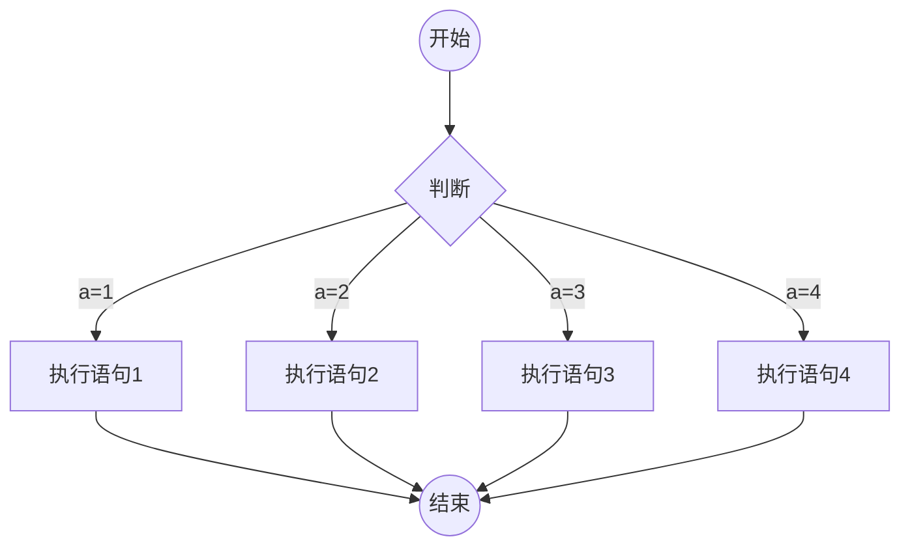

hexo默认不支持流程图，需要安装插件才能使用。具体参考
github上的链接，<a href="https://github.com/webappdevelp/hexo-filter-mermaid-diagrams">mermaid插件</a>。

<!--more-->
## 安装
本地安装插件，使用下面命令。完成后进行后面的配置。
```
npx install --save hexo-filter-mermaid-diagrams
```

## 修改配置
找到主题的配置文件 _config.yml，按照github上的配置指南一步步来。网上搜索的教程，看到的让找到hexo的根目录配置文件添加下面的配置项，但实际操作下来，还是需要在主题目录下的配置文件修改。
```
mermaid: ## mermaid url https://github.com/knsv/mermaid
  enable: true
  theme: forest
```

在 ```/themes/hexo-theme-yilia-plus/layout/_partial/after-footer.ejs```文件末尾添加代码。github上的教程已经给出了不同文件类型添加不同代码，yilia-plus是在after-footer.ejs文件中添加，其他类型主题按需找（after_footer.pug，after_footer.swig）
```
<% if (theme.mermaid.enable) { %>
	<script src='https://cdn.jsdelivr.net/npm/mermaid@8/dist/mermaid.min.js'></script>
	<script>
	  if (window.mermaid) {
		mermaid.initialize({theme: 'forest'});
	  }
	</script>
  <% } %>
```

## 尝试
输入下面的代码块，通过编辑器预览（vs code也需要下载mermaid插件支持）。能看到简单的流程图呈现，此时发布自己的博客即可。


如果博客部署好，本地编辑器预览没问题，但是在浏览器中查看，无法显示流程图的话，打开浏览器F12，查看是否加载出mermaid.js文件了。修改上一步中after-footer.ejs中增加的那部分代码中，引用的js源。（我这里给出的```https://cdn.jsdelivr.net/npm/mermaid@8/dist/mermaid.min.js```是可用的，可以在浏览器上先试探下引用的链接是否可用）。


## 修改背景色
由于我的主题默认代码块的背景颜色比较深，导致流程图在浏览器中显示时连接线看不清。需要修改流程图显示块的背景颜色。通过浏览器查看元素发现，流程图块有```class="mermaid"```，但通过直接修改css添加mermaid类的背景色并未生效。因为流程图显示块和代码块实际上使用的都是```<pre></pre>```这样的标签。
在 ```/themes/hexo-theme-yilia-plus/source/main.xxxx.css```文件中，找到```.article-entry .highlight,.article-entry pre```这块的定义，在代码块后面添加
```
.article-entry .highlight,.article-entry pre{
    background:#1a0139;
    margin:10px 0;
    padding:10px;
    overflow:hidden;
    overflow-x:auto;
    color:#fff;
    font-size:.9em;
    line-height:22.400000000000002px 
}
//添加下面的代码，取消背景色，这样流程图出来就看的很清晰了
.article-entry pre, .mermaid{
    background:transparent;
}
```