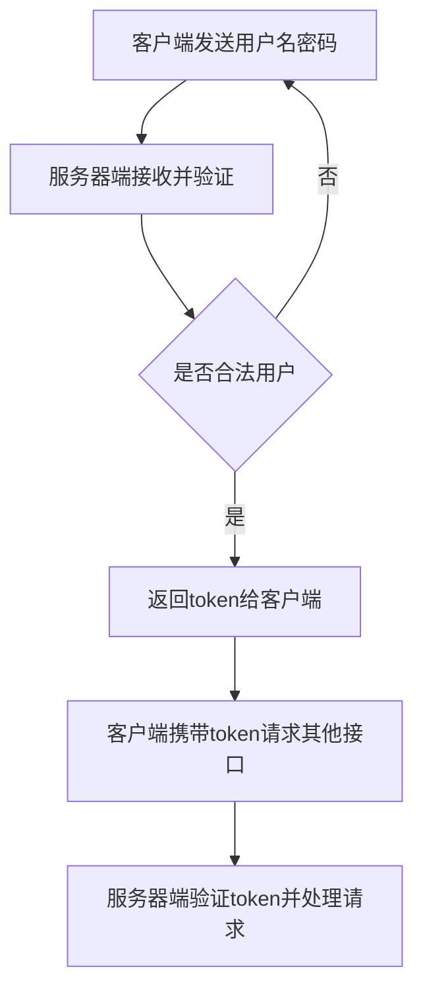

最近一直在和其他系统做对接，对接方式无非就是调别人的接口。按照别人甩来的文档，准备参数调用接口，获取返回数据。其中有些接口的方法是需要身份认证的，一般做法先去验证身份，合法用户获取到token，以后每次调用接口带着token走即可。
<!--more-->
大致流程如下

但是对接方api存在两个版本，旧版本并未实现身份认证，所有通信内容采用RSA的公钥进行加密，对方用私钥解密。公钥为pem格式，C#实现RSA加密只支持xml格式，所以有一下程序供测试。

``` csharp
static void Main(string[] args)
{
	string publicKey = @"MIIBIjANBgkqhkiG9w0BAQEFAAOCAQ8AMIIBCgKCAQEAq+lUR3gGmR/UEUmpSsjj
	vXBxYFOjUgzvg42PAvfPOL8LDD78Yu00crqcsBAJBLwrP............................................................IriWnXLlEjfGmqvDFiSQG4Q1nSRHIxpnd
	VLrTtxtDXW3NO9H5PM8wyESv+G2hXmankwSg6ipuEehKhFBw90nSTbR/+dibASvU
	.............
	.............
	";

	string bastionHostIP = "https://xxx.xx.xx.xx/index.php";
	string module = "ApiUser";
	string action = "getinfo";
	string url = bastionHostIP + "/" + module + "/" + action;

	User user = new User();
	user.id = "asdf";
	user.account = "asdf";

	//json封装
	string json = JsonConvert.SerializeObject(user);
	//rsa加密
	string rsa_json = RSAEncrypt(RSAPublicKey(publicKey), json);


	//post 数据
	Console.WriteLine(HttpHelper.HttpPost(url, "", rsa_json, "application/json"));
	Console.ReadLine();
}
```

``` csharp
/// <summary>    
/// RSA公钥pem-->XML格式转换， 
/// </summary>    
/// <param name="publicKey">pem公钥</param>    
/// <returns></returns>    
private static string RSAPublicKey(string publicKey)
{
	RsaKeyParameters publicKeyParam = (RsaKeyParameters)PublicKeyFactory.CreateKey(Convert.FromBase64String(publicKey));
	string XML = string.Format("<RSAKeyValue><Modulus>{0}</Modulus><Exponent>{1}</Exponent></RSAKeyValue>",
	Convert.ToBase64String(publicKeyParam.Modulus.ToByteArrayUnsigned()),
	Convert.ToBase64String(publicKeyParam.Exponent.ToByteArrayUnsigned()));
	return XML;
}

/// <summary>
/// RSA公钥加密数据
/// </summary>
/// <param name="xmlPublicKey"></param>
/// <param name="content"></param>
/// <returns></returns>
private static string RSAEncrypt(string xmlPublicKey , string content)
{
	string encryptedContent = string.Empty;
	using (RSACryptoServiceProvider rsa = new RSACryptoServiceProvider())
	{
		rsa.FromXmlString(xmlPublicKey);
		byte[] encryptedData = rsa.Encrypt(Encoding.Default.GetBytes(content), false);
		encryptedContent = Convert.ToBase64String(encryptedData);
	}
	return encryptedContent;
}

```

Nuget中安装包：Portable.BouncyCastle，程序中添加如下引用，
```csharp
using Org.BouncyCastle.Crypto.Parameters;
using Org.BouncyCastle.Security;
```

PEM格式公钥，以`-----BEGIN PUBLIC KEY-----`开始，`-----END PUBLIC KEY-----`结束
```
-----BEGIN PUBLIC KEY-----
MIGfMA0GCSqGSIb3DQEBAQUABgQD5MIb5ZQhNGhsUjfFbn7y6nY6tsqV9LcC2s/rLpu9sz8CplsTy2SuTG0o7y9ICXW6oRUC9bVxI8TfTK4bbSrNQ6UoExzQFdbc3pEGun3iCy+inBhIC6xf5Z7lN+WqTKCZ607iLwKh+wDdZc6U4x1rxF4vngk1sXIdnYEoGjpRNLQIDAQAB
-----END PUBLIC KEY-----
```

xml格式公钥
``` xml
<RSAKeyValue>
    <Modulus>
        xA7SEU+e0yQH5rm9kbCDN9o3aPIo7HbP7tX6WOocLZAtNfyxSZDU16ksL6
        WjubafOqNEpcwR3RdFsT7bCqnXPBe5ELh5u4VEy19MzxkXRgrMvavzyBpV
        RgBUwUlV5foK5hhmbktQhyNdy/6LpQRhDUDsTvK+g9Ucj47es9AQJ3U=
    </Modulus>
    <Exponent>
        AQAB
    </Exponent>
</RSAKeyValue>
```

C#的RSA加密只实现了公钥加密、私钥解密。而并没有私钥加密，公钥解密的实现。