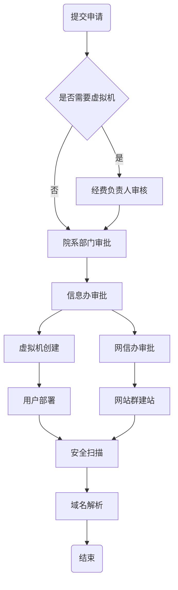
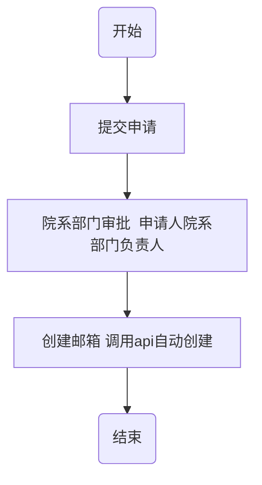
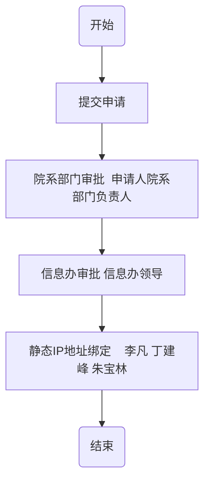
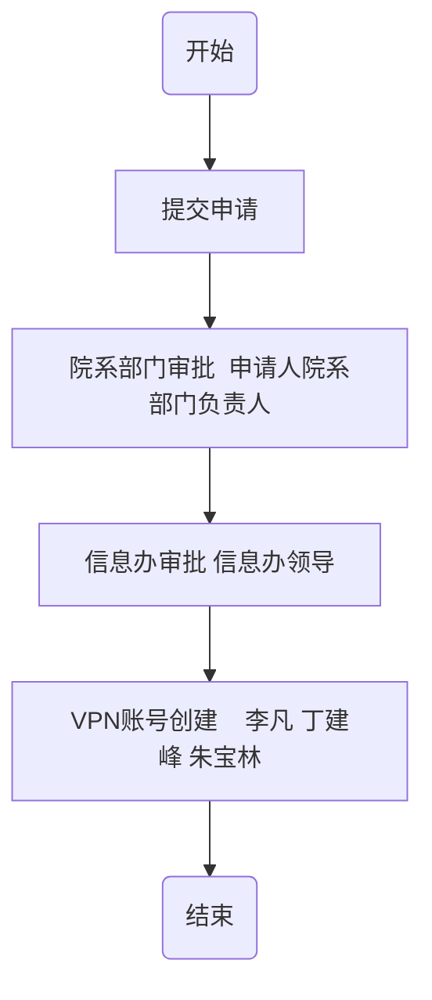

## 网站类申请

```mermaid
graph TB
A(提交申请)-->
C{是否需要虚拟机}
C -->|是| D[经费负责人审核]
C -->|否| E[院系部门审批]
D --> E[院系部门审批] 
E --> G[信息办审批]
G --> H[虚拟机创建]
G --> I[网信办审批]
H --> J[用户部署]
I --> K[网站群建站]
J --> L[安全扫描]
K --> L
L --> M[域名解析]
M --> N(结束)
```

```mermaid
graph TB
A(开始)-->
B[提交申请]-->
C[院系部门审批  申请人院系部门负责人] -->
D[创建邮箱  调用api自动创建]
D --> K(结束)
```

```mermaid
graph TB
A(开始)-->
B[提交申请]-->
C[院系部门审批  申请人院系部门负责人] -->
D[信息办审批  信息办领导] -->
E[静态IP地址绑定    李凡 丁建峰 朱宝林]--> 
K(结束)
```

```mermaid
graph TB
A(开始)-->
B[提交申请]-->
C[院系部门审批  申请人院系部门负责人] -->
D[信息办审批  信息办领导] -->
E[VPN账号创建    李凡 丁建峰 朱宝林]--> 
K(结束)
```

