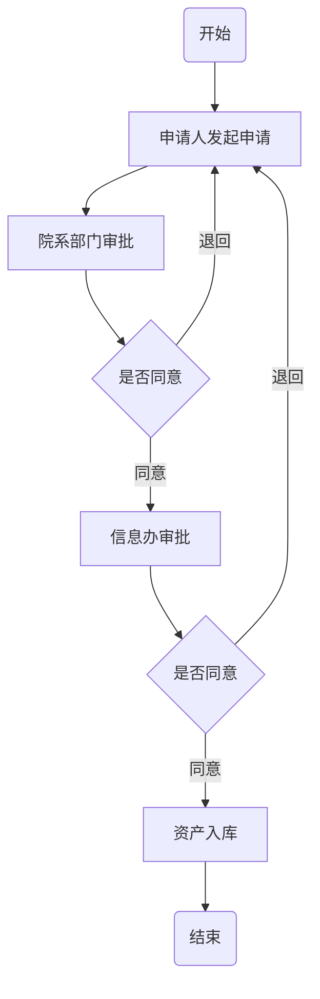

## 新申请

```mermaid
   graph TB
    A(开始) -->
    B[申请人发起申请] -->
    C[院系部门审批] -->
    D{是否同意}
    D -->|同意| E[信息办审批]
    D -->|退回| B[申请人发起申请]
    E -->
    F{是否同意}
    F -->|同意| H[资产入库] --> G(结束)
    F -->|退回| B[申请人发起申请]
```

## 申请修改

```mermaid
   graph TB
    A(开始) -->
    B[申请人发起申请] -->
    C[院系部门审批] -->
    D{是否同意}
    D -->|同意| E[信息办审批]
    D -->|退回| B[申请人发起申请]
    E -->
    F{是否同意}
    F -->|同意| H[资产入库] --> G(结束)
    F -->|退回| B[申请人发起申请]
```

## 困难点

1. 数据对接
    * 人员、部门数据自成体系，需要与UBI对接
    * 原数据结构是否重构
2. 申请修改表单较复杂
