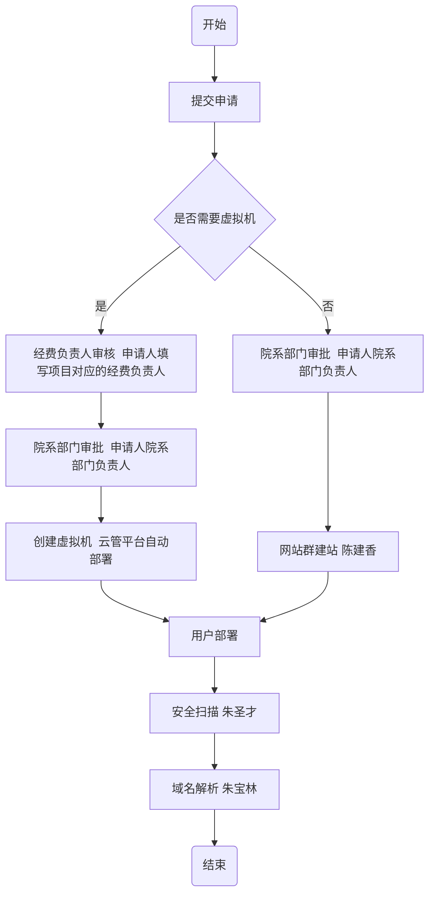
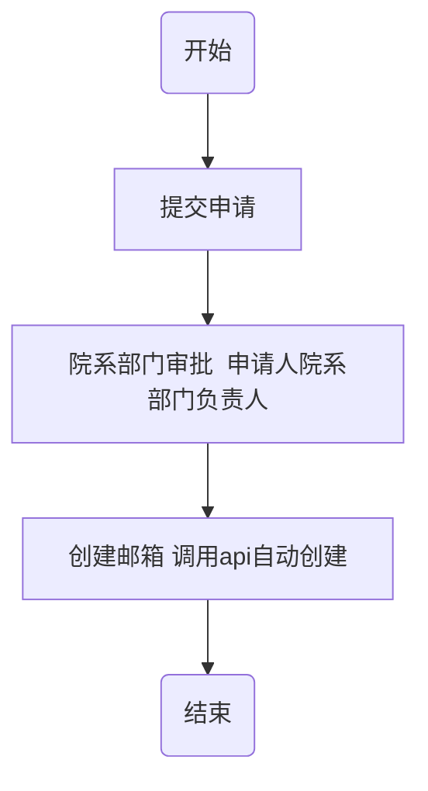
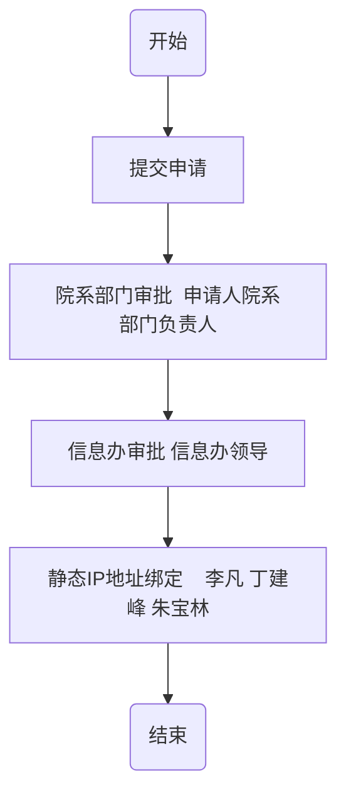
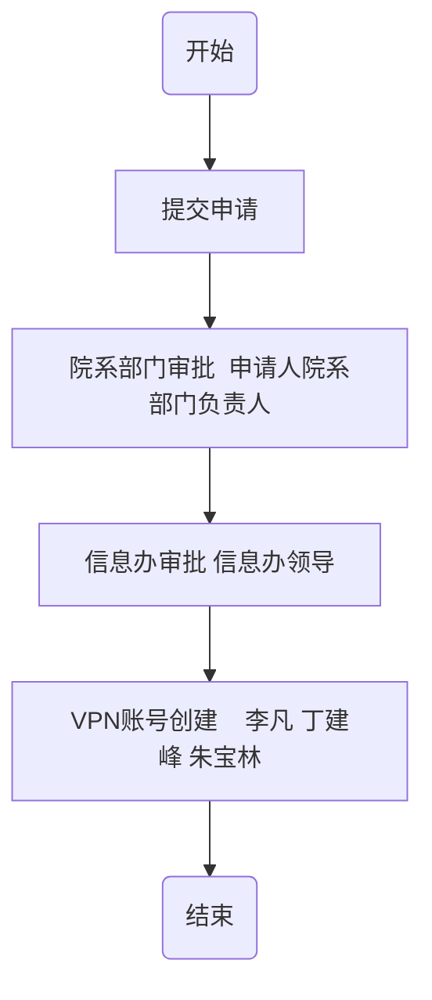

## 网站类申请

```mermaid
graph TB
A(开始)-->
B[提交申请]-->
D{是否需要虚拟机}
D -->|是| E[经费负责人审核  申请人填写项目对应的经费负责人]
D -->|否| C[院系部门审批  申请人院系部门负责人]---> F[网站群建站  陈建香]
E --> L[院系部门审批  申请人院系部门负责人]
L --> M[创建虚拟机  云管平台自动部署]
M --> G
F --> G[用户部署]
G --> H[安全扫描    朱圣才]
H --> I[域名解析    朱宝林]
I --> K(结束)
```

```mermaid
graph TB
A(开始)-->
B[提交申请]-->
C[院系部门审批  申请人院系部门负责人] -->
D[创建邮箱  调用api自动创建]
D --> K(结束)
```

```mermaid
graph TB
A(开始)-->
B[提交申请]-->
C[院系部门审批  申请人院系部门负责人] -->
D[信息办审批  信息办领导] -->
E[静态IP地址绑定    李凡 丁建峰 朱宝林]--> 
K(结束)
```

```mermaid
graph TB
A(开始)-->
B[提交申请]-->
C[院系部门审批  申请人院系部门负责人] -->
D[信息办审批  信息办领导] -->
E[VPN账号创建    李凡 丁建峰 朱宝林]--> 
K(结束)
```

