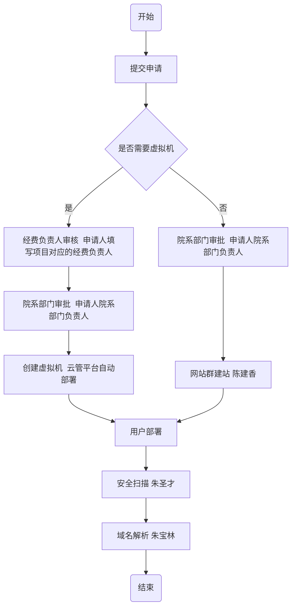
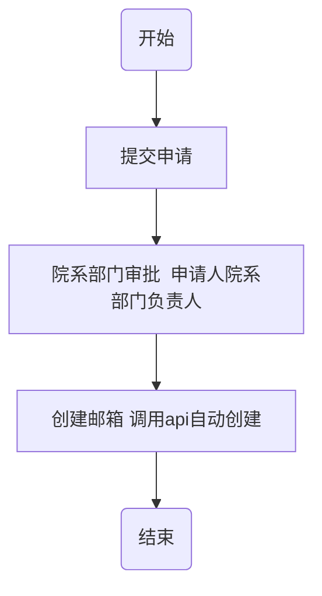
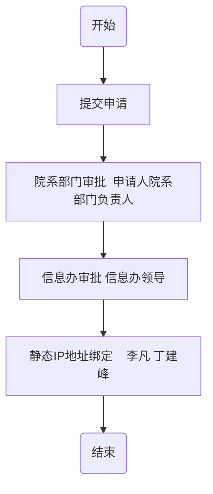
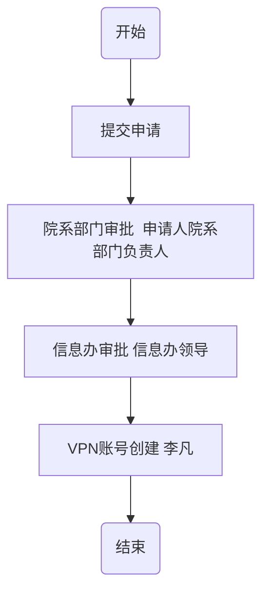

## 网站类申请

1. 用户申请
用户发起申请，填写网站基本信息，选择部署方式
2. 部署方式：
 * 选择网站群：经过部门审核，进入信息办网站群建站环节，完成后进入用户部署，安全扫描，域名解析后流程结束
 * 选择虚拟机：经过经费负责人审核，进入院系负责人审核，同意后云管平台根据参数部署虚拟机，完成后反馈给UBI，进入用户部署，安全扫描，域名解析后流程结束。

虚拟机部署方式：
1. 确定云管平台部署虚拟机所必须的参数，接口信息
2. 财务系统对接，获取经费号及经费负责人信息（或者直接走云平台接口获取）
3. 虚拟机收费情况，是将收费逻辑在UBI上实现，还是云管平台提供接口提供计算结果
4. 部署完成后反馈给UBI平台接口定义

